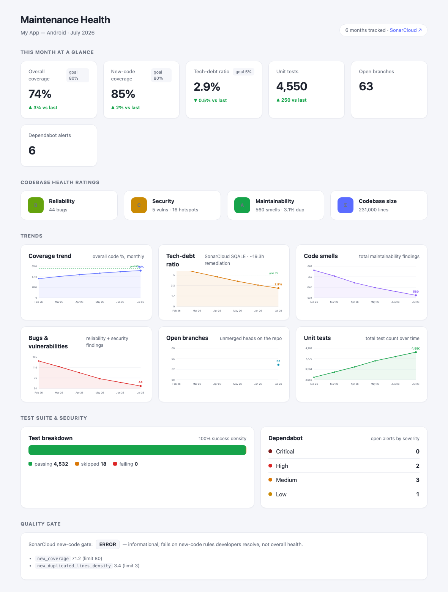

# maint-dashboard

A local **maintenance-health dashboard** for any codebase tracked on **SonarCloud +
GitHub**. It captures one metrics snapshot per month and gives you two surfaces
over the same data:

- **An interactive web app** (`maintdash serve`) — Chart.js trends with hover
  tooltips, a month-range filter, and one-click *Snapshot now* / *Rebuild report*.
- **A self-contained HTML report** (`maintdash report`) — a single file, no assets,
  no server. The export you screen-share to Product Owners or paste into a
  monthly tactical / Notion.

It was built for a *Major Maintenance* holacracy role tracking an Android app, but
it's **codebase-agnostic**: point the config at any SonarCloud project (Android,
iOS, backend, web) and any GitHub repo and it just works.



## What it tracks

Scope is **codebase health & maintenance work** (not developer-efficiency metrics
like DORA/build-time — those belong to a separate concern):

| Metric | Source |
|---|---|
| Overall + new-code coverage | SonarCloud |
| Tech-debt ratio (SQALE) + remediation time | SonarCloud |
| Reliability / Security / Maintainability ratings (A–E) | SonarCloud |
| Bugs, vulnerabilities, security hotspots, code smells, duplication | SonarCloud |
| Unit tests (passing / skipped / failing) + success density | SonarCloud |
| Lines of code | SonarCloud |
| Open branches | GitHub |
| Dependabot alerts by severity | GitHub |

## Requirements

- **Python 3** (the CLI is stdlib-only — no installs). Only the web app needs
  **Flask**, which `maintdash serve` installs into a project-local `.venv` on first
  run. Nothing touches your system Python.
- **[`gh` CLI](https://cli.github.com/)**, authenticated (`gh auth login`). All
  GitHub reads go through it, so there's no GitHub token to manage.
- A **SonarCloud token** (see *Configuration* below).

## Quick start

```bash
git clone https://github.com/<you>/maint-dashboard.git
cd maint-dashboard
./install.sh                 # symlinks `maintdash` into ~/.local/bin, seeds config.json
$EDITOR config.json          # point it at your Sonar project + GitHub repo

export SONAR_TOKEN=xxxxx      # or store it in the Keychain (see below)
maintdash backfill           # optional: seed this year from real Sonar history
maintdash serve              # open the interactive dashboard
```

## Commands

```bash
maintdash serve      # launch the local web app (default http://127.0.0.1:8765)
maintdash run        # snapshot this month + build the report + open it
maintdash snapshot   # just capture this month's metrics
maintdash backfill   # seed monthly snapshots from real SonarCloud history
maintdash report     # rebuild the shareable HTML report and open it
maintdash show       # print the latest snapshot as JSON
```

Snapshots are stored one file per month in `data/YYYY-MM.json`; re-running in the
same month overwrites it. Reports are written to `reports/maintenance-YYYY-MM.html`.
Trend lines fill in as months accumulate.

## Configuration

Everything project-specific lives in **`config.json`** (copied from
`config.example.json` on first install; git-ignored so your keys stay local):

```json
{
  "project_label": "My App — Android",
  "sonar": {
    "base_url": "https://sonarcloud.io",
    "organization": "my-sonar-org",
    "project_key": "my-org_my-project",
    "token_env": "SONAR_TOKEN",
    "keychain": { "service": "maintdash", "account": "sonar-token" }
  },
  "github": { "owner": "my-github-org", "repo": "my-repo" },
  "goals": { "coverage_pct": 80, "new_coverage_pct": 80, "max_debt_ratio_pct": 5 }
}
```

- **`project_label`** — shown in the header.
- **`sonar.project_key` / `organization`** — from your SonarCloud project URL.
- **`github.owner` / `repo`** — the repo to read branches + Dependabot alerts from.
- **`goals`** — target lines drawn on the KPI cards and charts.

### The SonarCloud token

Resolution order (first hit wins):

1. **macOS Keychain** — `security add-generic-password -s <service> -a <account> -w <TOKEN>`
   using the `service`/`account` from your config. Preferred on macOS so no token
   sits in your shell profile.
2. **Environment variable** named by `sonar.token_env` (default `SONAR_TOKEN`) —
   the portable option, and the one to use on Linux/Windows.

Use a token with permission to read the project's measures.

### Running iOS + Android (or several projects)

Clone the repo once per project into separate directories, each with its own
`config.json` and `data/`. E.g. `maint-dashboard-android/` and
`maint-dashboard-ios/`, each pointing at its platform's SonarCloud project. The
tool never assumes a platform — it's just SonarCloud + GitHub.

## Monthly automation

### macOS (launchd)

A template lives in [`launchd/maintdash-snapshot.plist.template`](launchd/maintdash-snapshot.plist.template).
Copy it to `~/Library/LaunchAgents/com.<you>.maintdash-snapshot.plist`, replace the
`__PROJECT_DIR__` / name placeholders, then:

```bash
launchctl bootstrap gui/$(id -u) ~/Library/LaunchAgents/com.<you>.maintdash-snapshot.plist
```

It defaults to the **25th of each month at 09:00** (edit `Day`/`Hour`/`Minute`).
Ensure the `PATH` in the plist includes the directory containing `gh`.

### Linux (cron)

```cron
0 9 25 * *  cd /path/to/maint-dashboard && SONAR_TOKEN=xxx /usr/bin/python3 maintdash.py snapshot
```

## How it fits together

```
config.json ──▶ sources.py ──▶ data/YYYY-MM.json ──┬──▶ report.py ──▶ reports/*.html   (PO export)
   (Sonar + gh)                                     └──▶ app.py    ──▶ web app :8765     (daily use)
```

Both surfaces read the same snapshots and `sources.py`, so the numbers never
diverge. Chart.js is vendored under `static/` so the web app works offline.

## License

MIT — see [LICENSE](LICENSE). Bundles [Chart.js](https://www.chartjs.org/) (MIT).
